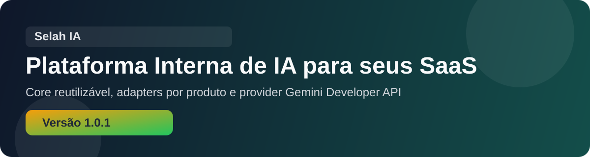

<p align="center">
  
</p>

<h1 align="center">🕊️ Selah IA</h1>

<p align="center">
  
  
  
  
</p>

# 🤖 Selah IA
Plataforma interna de IA da codeStage, com adapters por domínio sobre um core reutilizável (provider de LLM plugável — Gemini por padrão, ou Ollama — + capabilities de geração de texto/JSON estruturado).

## ✨ Visão rápida

- 🧠 **Core reutilizável:** providers, capabilities e adapters desacoplados.
- 🔐 **Segurança entre serviços:** autenticação interna com `X-Selah-Api-Key`.
- 🧩 **Adaptação por domínio:** PraiseApp e LUMEN compartilham a mesma base, com prompts e contratos próprios.
- 🛟 **Fallback inteligente:** respostas genéricas disparam retry guiado e regras locais quando necessário.

## 🧩 Funcionalidades resumidas

### 🆕 Destaques da versão 1.2.0
- **Adapter LUMEN reforçado** para perguntas sobre quitação de dívida, reorganização financeira e vida pessoal.
- **Extração de fatos da pergunta** para citar valores, sinais e alvos explícitos do usuário.
- **Saída estruturada ampliada** para até 6 highlights e 6 suggested actions.
- **Fallback rule-based** quando a IA insistir em respostas genéricas demais.
- **Cobertura de testes** para retry e fallback do adapter do LUMEN.

### 🧠 1) Core da plataforma
- Geração de texto e JSON estruturado com validação pós-provider.
- Contrato único para troca futura de provider sem reescrever adapters.
- Capabilities reutilizáveis para outros SaaS internos.

### 🔌 2) Provider atual
- Selecionável via `LLM_PROVIDER` (`gemini` ou `ollama`), **padrão `gemini`**.
- `Gemini` (Google AI Studio, free tier disponível), modelo padrão `gemini-2.5-flash`.
- `Ollama` (local/self-hosted, só com `LLM_PROVIDER=ollama`), modelo padrão `gemma4:e4b`. Suporte a chat com histórico de mensagens, tool calling e imagens inline.

### ⛪ 3) Adaptadores ativos
- **PraiseApp:** Kids, Louvor, Consolidação e Saúde Ministerial.
- **LUMEN:** Assistente de vida com foco em finanças, decisões práticas e rotina pessoal.
- **Agilis:** Assistente do workspace (chat com histórico), resumo de projeto e de tarefa, plano de ação, gargalos, sugestão de responsável, redistribuição de carga e brief estratégico.

## 🧱 Stack

- NestJS 10
- Gemini (provider padrão, hospedado) ou Ollama (provider local, via `LLM_PROVIDER=ollama`)
- Axios
- Class Validator / Class Transformer
- Jest

## ⚙️ Variáveis de ambiente

1. Copie o arquivo base:

```bash
cp .env.example .env
```

2. Configure obrigatoriamente:
- `SELAH_INTERNAL_API_KEYS`
- `GEMINI_API_KEY` (provider padrão) ou `OLLAMA_BASE_URL` (se `LLM_PROVIDER=ollama`)

3. Variáveis principais:
- `PORT=3010`
- `SELAH_DEFAULT_LOCALE=pt-BR`
- `SELAH_PUBLIC_VERSION=v1`
- `SELAH_ALLOWED_SOURCE_APPS=PraiseAppBack,LumenBack`
- `LLM_PROVIDER=gemini` (padrão; ou `ollama`)
- `GEMINI_API_KEY=`
- `GEMINI_MODEL=gemini-2.5-flash`
- `GEMINI_TIMEOUT_MS=45000` (orçamento total por chamada, inclui retries)
- `GEMINI_MAX_RETRIES=2` / `GEMINI_RETRY_BASE_MS=800` / `GEMINI_RETRY_MAX_DELAY_MS=8000` (retry com backoff exponencial + jitter só em 429, 5xx e erro de rede; respeita `Retry-After`)
- `OLLAMA_BASE_URL=http://localhost:11434` (só com `LLM_PROVIDER=ollama`)
- `OLLAMA_MODEL=gemma4:e4b`
- `OLLAMA_TIMEOUT_MS=120000`

## 🚀 Como executar

### 1. Instalar dependências

```bash
npm install
```

### 2. Desenvolvimento

```bash
npm run start:dev
```

### 3. Build + produção local

```bash
npm run build
npm start
```

### 4. Healthcheck

```bash
curl http://localhost:3010/health
```

## ✅ Verificação rápida

```bash
npm run build
npm test -- --runInBand
```

## 🔐 Segurança interna

O `SelahIA` usa autenticação entre serviços com:

- `X-Selah-Api-Key` (obrigatório)
- `X-Source-App` (informativo quando a chave é por app)
- `X-Request-Id` opcional

Regra operacional:
- o frontend nunca fala direto com o `SelahIA`
- o backend do SaaS autentica, monta contexto e decide o que persiste

### Chave por app
Cada app consumidor tem a sua chave em `SELAH_APP_KEYS=LumenBack:<chave>,PraiseAppBack:<chave>` (gere com `openssl rand -hex 32`).
- **A identidade do app vem da chave**, não do header. Um app não consegue se passar por outro mudando o `X-Source-App`.
- Revogar um app = remover a chave dele; os outros não são afetados.
- Rotação sem downtime: liste duas chaves do mesmo app, atualize o app e remova a antiga.
- O Selah recusa subir se a mesma chave estiver em dois apps, se a entrada for malformada, ou se usar a chave `selah-dev-key` em produção.
- `SELAH_INTERNAL_API_KEYS` (legado) continua aceita para migração, mas não identifica o app. Remova em produção depois de migrar.

### Rate limit
Limite por app, em requisições por minuto (token bucket, rajada até o limite): `SELAH_RATE_LIMIT_PER_MINUTE` (padrão 60, `0` desliga) e `SELAH_RATE_LIMITS=LumenBack:120,PraiseAppBack:30` para sobrescrever por app. Ao exceder, o Selah responde `429` com `Retry-After`. Ajuste o valor para não passar da cota do seu plano do Gemini. O contador fica em memória (uma instância); o `deploy/nginx/selah.conf` traz uma proteção adicional por IP.

## 🧭 Estrutura principal

```text
src/
  adapters/
    agilis/
      workspace/
    lumen/
      life-assistant/
    praiseapp/
      kids/
  capabilities/
    structured-output/
    text/
  common/
    auth/
    logging/
  health/
  providers/
    ollama/
    gemini/
```

## 📌 Documentação complementar

- 📝 Release notes 2.5.1: `docs/releases/v2.5.1.md`
- 📝 Release notes 2.5.0: `docs/releases/v2.5.0.md`
- 📝 Release notes 2.4.1: `docs/releases/v2.4.1.md`
- 📝 Release notes 2.4.0: `docs/releases/v2.4.0.md`
- 📝 Release notes 2.3.0: `docs/releases/v2.3.0.md`
- 📝 Release notes 2.2.0: `docs/releases/v2.2.0.md`
- 📝 Release notes 2.0.0: `docs/releases/v2.0.0.md`
- 📝 Release notes 1.3.0: `docs/releases/v1.3.0.md`
- 📝 Release notes 1.2.0: `docs/releases/v1.2.0.md`
- 📝 Release notes 1.1.0: `docs/releases/v1.1.0.md`
